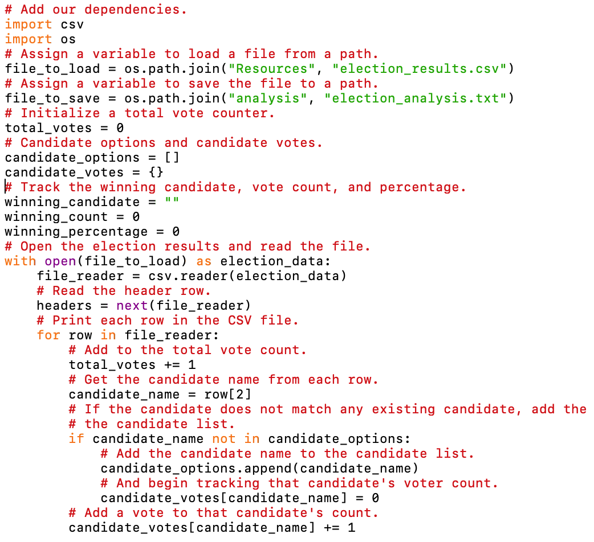
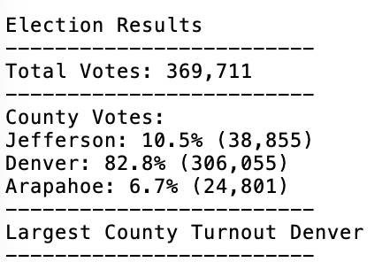
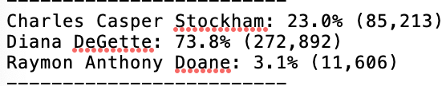
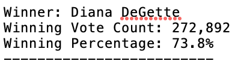

# Election_Analysis

## Project Overview
A Colorado Board of Elections employee has given you the following tasks to complete the election audit of a recent local congressional election.

1. Calculate the total number of votes cast.
2. Get a complete list of candidates who received votes.
3. Calculate the total number of votes each candidate received.
4. Calculate the percentage of votes each candidate won.
5. Determine the winner of the election based on popular vote. 

## Resources
- Data Source: election_results.csv
- Software: Python 3.9, Visual Studio Code

## Summary
 

After writing, debugging, and running the above Python script, the analysis of the election show that:

There were 369,711 votes cast in the election.

The candidates were:
  1. Charles Casper Stockham
  2. Diana DeGette
  3. Raymon Anthony Doane
  
The candidate results were:

    1. Charles Casper Stockham received 23% of the vote and 85,213 votes
    2. Diana DeGette received 73.8% of the vote and 272,892 votes
    3. Raymon Anthony Doane received 3.1% of the vote and 11,606 votes
    
The winner of the election was *Diana Degette*, who received 73.8% of the vote and 272,892 votes
  
 ## Challenge Overview
The election commission has requested some additional data to complete the audit:

The voter turnout for each county
The percentage of votes from each county out of the total count
The county with the highest turnout

This new assignment consists of two technical analysis deliverables and a written report to deliver your results. You will submit the following:

Deliverable 1: The Election Results Printed to the Command Line
Deliverable 2: The Election Results Saved to a Text File
Deliverable 3: A written Analysis of the Election Audit
 
 ## Challenge Summary
### Overview of Election Audit: Explain the purpose of this election audit analysis.
The purpose of this audit was to provide the Colorado Board of Elections with additional data to complete the audit. In addition to the information already provided, they wanted the voter turnout by county, the percentage of votes from each of those counties, and the county with the highest turnout. With this information, they will have a better idea of how this election turned out.

### Election-Audit Results: Using a bulleted list, address the following election outcomes. Use images or examples of your code as support where necessary.

### How many votes were cast in this congressional election?
There were 369,711 votes cast in this congressional election.

### Provide a breakdown of the number of votes and the percentage of total votes for each county in the precinct.
Denver had the largest county turnout with 306,055 votes (82.8% of the vote total).

### Provide a breakdown of the number of votes and the percentage of the total votes each candidate received.

### Which candidate won the election, what was their vote count, and what was their percentage of the total votes?

